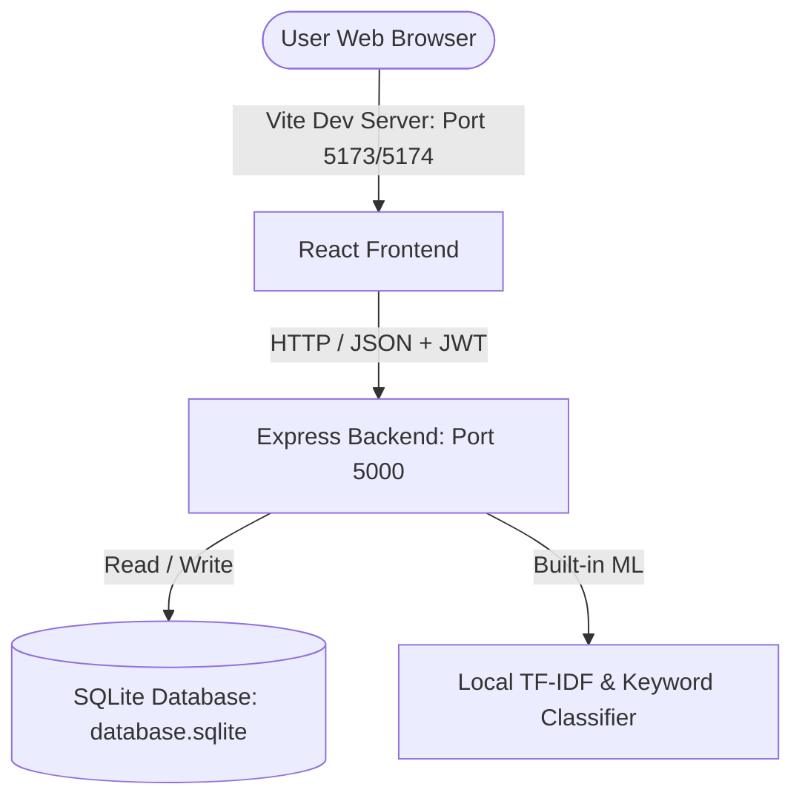

# AI-Powered Similar Question Finder & Auto-Tagger

An intelligent, multi-user question management and analysis system. The application automatically classifies academic questions into subjects (Physics, Biology, Chemistry, Mathematics, Computer Science, or General) using sentence embeddings and performs real-time semantic similarity checks against a shared repository to flag duplicates and show percentage-based match scores.

---

## 🚀 Key Features

* **Real-Time Auto-Tagging (Classification)**: Predicts the academic subject of a question as you type, mapping it to categories like *Physics*, *Biology*, *Chemistry*, *Mathematics*, *Computer Science*, or *General*.
* **Semantic Similarity Checking**: Compares incoming text against all existing questions in the database using high-quality sentence embeddings, displaying percentage matches.
* **Duplicate Detection Safeguard**: Flags questions that are over **85%** semantically identical as **"Duplicate Danger"** and blocks redundant entries.
* **Multi-User Isolation**: Protects history list privacy per user using secure registration, bcrypt password hashing, and JWT session tokens.
* **Dual-Engine AI Fallback**: Detects system constraints automatically. If high-memory deep learning libraries (PyTorch/Transformers) fail to load, the system falls back to a mathematical TF-IDF model.
* **Modern Premium Interface**: Features a custom dark-themed UI with clean typography, interactive charts, and real-time dashboard analytics.

---

## 🛠️ Tech Stack

### Frontend (User Interface)
* **React 18** (Vite build system)
* **Lucide React** (Modern, clean icon pack)
* **Custom Vanilla CSS** (Responsive grid, dark/glassmorphic design system)

### Backend (Orchestration & Storage)
* **Node.js & Express** (Rest API & Authentication gateway)
* **SQLite3** (Lightweight database for user credentials and question mappings)
* **JWT (JSON Web Tokens) & Bcrypt.js** (Secure login sessions and password encryption)

### AI / ML Service
* **Embedded NLP Similarity Engine** (Built-in TF-IDF & Cosine Similarity with 1/2-gram tokenizers directly in JavaScript)

---

## 📂 System Architecture



### Database Schema

#### `users` Table
| Column | Type | Constraints |
| :--- | :--- | :--- |
| `id` | INTEGER | PRIMARY KEY AUTOINCREMENT |
| `email` | TEXT | UNIQUE, NOT NULL |
| `password` | TEXT | NOT NULL (Bcrypt hashed) |
| `created_at` | DATETIME | DEFAULT CURRENT_TIMESTAMP |

#### `questions` Table
| Column | Type | Constraints |
| :--- | :--- | :--- |
| `id` | INTEGER | PRIMARY KEY AUTOINCREMENT |
| `user_id` | INTEGER | FOREIGN KEY REFERENCES users(id) ON DELETE CASCADE |
| `question_text`| TEXT | NOT NULL |
| `topic` | TEXT | NOT NULL |
| `similar_questions`| TEXT | JSON String of matching history scores |
| `created_at` | DATETIME | DEFAULT CURRENT_TIMESTAMP |

---

## ⚙️ Local Setup and Running

Ensure you have **Node.js (v18+)** installed.

### 1. Install Dependencies
Run the root command to install packages for the root, frontend, and backend:
```bash
npm run setup:all
```

### 2. Run the Application
You can run the frontend and backend services concurrently:
```bash
npm run dev
```

Once running, navigate to **[http://localhost:5173](http://localhost:5173)** (or `5174` if `5173` is busy) to interact with the application.

---

## 🧠 How the AI/ML Model Works

### 1. Alignment & Auto-Tagging
* A set of anchor phrases representing each academic category (e.g., Physics, Biology) is vectorized using a local TF-IDF model.
* The system computes the **cosine similarity** between the new question's TF-IDF vector and the centroids of all subject anchor vectors.
* A keyword boosting dictionary applies an additional weight (up to 0.40) for high-confidence terms (like "mitosis", "quadratic", "algorithm").
* The category with the highest final score is assigned as the predicted tag.

### 2. Semantic Similarity Verification
* The question's TF-IDF vector is compared against the TF-IDF vectors of all previously saved questions in the database.
* The similarity score ranges from `0.0` (entirely different) to `1.0` (word-for-word match).
* If a score exceeds **`0.85` (85%)**, the frontend flags it with a warning banner and disables the submit button to maintain data integrity.
